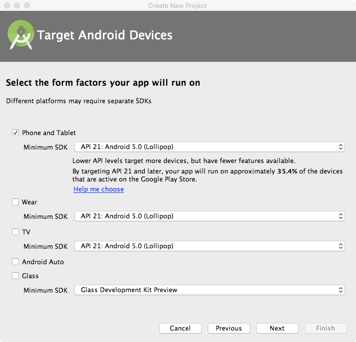
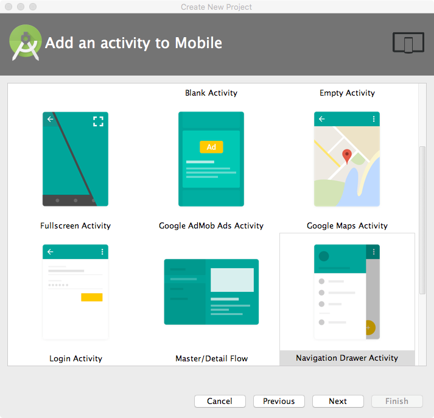

# Creating an Android Project

Let's create an Android project together. Open **Android Studio**. Then select **Create New Project**. You'll see the following window:

Each app will need a *name*, a *domain*, and a *location* to save the project.

Next, you'll be asked to specify which versions of Android you want to target.

You can support *Phones*, *TabletS*, *Android Wear watches*, *Google Glass*, and *Android Auto* systems.

Next, you'll need to add an *Activity*.

You can select from a large selection of application starter kits!

Finally, you'll need to *customize your activity*.

You can change names here if you like; if you are unfamiliar with Android development we suggest that you use the default values and **finish**.
