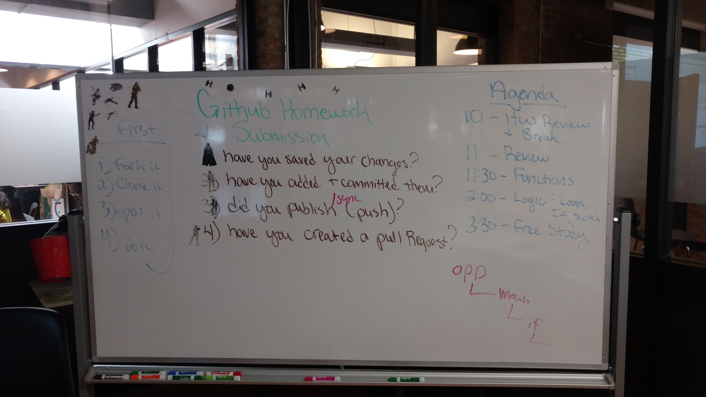

## Git Workflow

* `git` is version control system. It runs on your computer.
* `Github` is the dropbox of `git`; it hosts your repositories online.
* We create repositories locally and then _publish_ them to Github online.
* For homework, we _fork_ a repository and then _clone_ it to our computer.
* Anytime we make changes, we can _add_ and _commit_ them with a **title** and **description**.
* We can then _publish_ or _sync_ our changes online to Github.
* When submitting homework, we need to create a _pull request_.

#### Homework Submission

