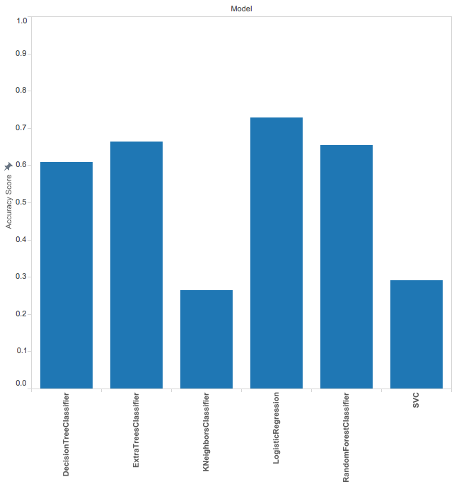
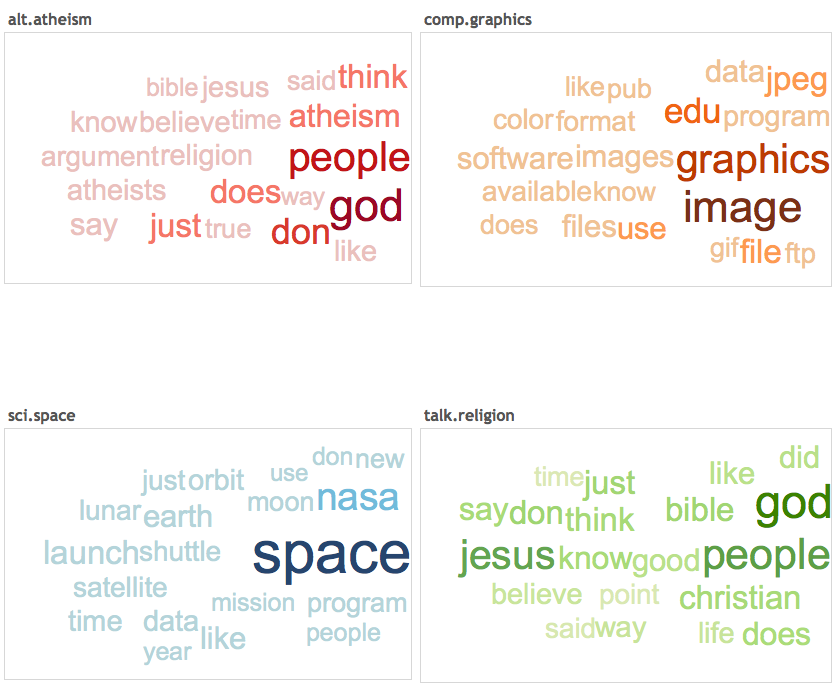
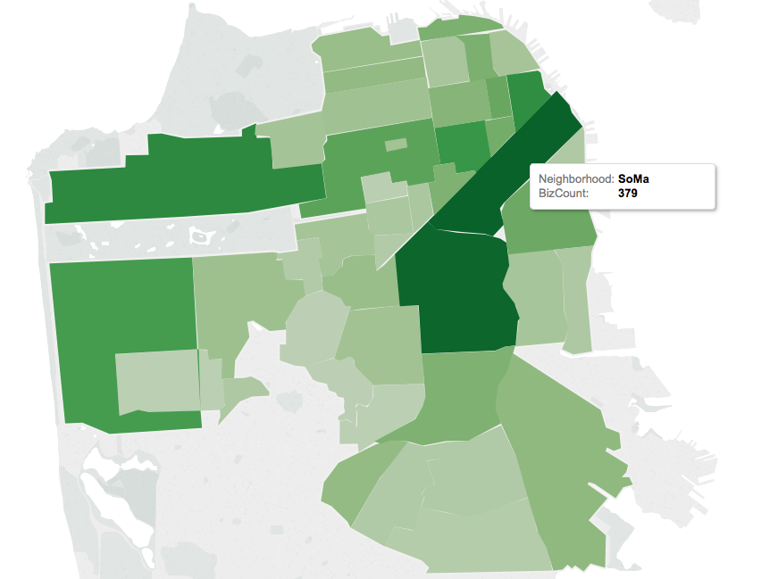

#  Communicating results
Week 6| Lesson 5.2

### LEARNING OBJECTIVES
*After this lesson, you will be able to:*
- Analyze costs and benefits when presenting data
- Decide how to present it based on audience
- Find common mistakes in visualizations
- Correct such mistakes
- Visualize results in tableau

### STUDENT PRE-WORK
*Before this lesson, you should already be able to:*
- Demonstrate ability to perform simple EDA using Tableau
- Recall the defining criteria of a confusion matrix
- Illustrate the principles of a strong classification report

### INSTRUCTOR PREP
*Before this lesson, instructors will need to:*
- Read in / Review any dataset(s) & starter/solution code
- Generate a brief slide deck
- Prepare any specific materials
- Provide students with additional resources

### LESSON GUIDE
| TIMING  | TYPE  | TOPIC  |
|:-:|---|---|
| 5 min | [Opening](#opening) | Opening: |
| 15 min | [Review](#review) | Review: Model Quality |
| 10 min | [Discussion](#discussion) | Discussion: Cost Benefit Analysis |
| 5 min | [Introduction](#introduction_2) | Intro: The criteria for a good visualization |
| 10 min | [Guided-practice](#guided-practice) | Guided practice: Find the error |
| 10 min | [Guided-practice](#guided-practice_2) | Guided practice: Correct the error |
| 25 min | [Ind-practice](#ind-practice) | Independent practice: Visualizing model results in Tableau |
| 5 min | [Conclusion](#conclusion) | Conclusion |

## Opening:  (5 min)
In Week 4, Lesson 5.1 we discussed how to present data to stakeholders that are less technical than we are. We will extend that topic now considering a few additional tools and in particular how to communicate results when using ensemble models.

**Check:** Do you expect huge differences in how to handle presentation of results for ensemble models?
> Answer: not really, presentation of results should be almost model independent

## Review: Model Quality (15 min)
Let's review the methods we have learned so far to assess model quality.

### Classification problems
**Check:** Can you name few ways to judge the quality of a classification model?
> Accuracy Score, Precision, Recall, F1-Score, Confusion Matrix

**Check:** For each of these ways, can you give the definition?
> Instructor note: help them give definition, then write definition on whiteboard. You can review definitions [here](http://scikit-learn.org/stable/modules/model_evaluation.html)

**Check:** Can you think of situations you have encountered where you would choose one or the other?
> Debate: Finesse VS communicability

### Regression problems
**Check:** Can you name few ways to judge the quality of a classification model?
> RMSE, R2

**Check:** For each of these ways, can you give the definition?
> Instructor note: help them give definition, then write definition on whiteboard. You can review definitions [here](http://scikit-learn.org/stable/modules/model_evaluation.html)

**Check:** Can you think of situations you have encountered where you would choose one or the other?
> Debate: Finesse VS communicability

**Check:** What graphical tools have we encountered to explain model quality?
> [Learning curves, Validation curves](http://scikit-learn.org/stable/modules/learning_curve.html)

## Discussion: Cost Benefit Analysis (10 min)

One tool that complements the confusion matrix is cost-benefit analysis, where you attach a _value_ to correctly and incorrectly predicted data.

Like the Precision-Recall trade off, there is a balancing point to the _probabilities_ of a given position in the confusion matrix, and the _cost_ or _benefit_ to that position. This approach allows you to not only add a weighting system to your confusion matrix, but also to speak the language of your business stakeholders (i.e. communicate your values in dollars!).

Consider the following marketing problem: As a data scientist working on marketing spend, you've build a model that reduces user churn -- the number of users who decide to stop paying for a product -- through a marketing campaign. Your model generates a confusion matrix with the following probabilities (these probabilities are calculated as the value in that position over the sum of the sample):

|||
|---|---|
| TP: 0.2 | FP: 0.2 |
| FN: 0.1 | TN: 0.5 |

In this case:
- The _benefit_ of a true positive $B_{TP}$ is the retention of a user (\$10 for the month)
- The _cost_ of a false positive $C_{FP}$ is the spend of the campaign per user (-\$0.05)
- The _cost_ of a false negative $C_{FN}$ (someone who could have retained if sent the campaign) is, effectively, 0 (we didn't send it... but we certainly didn't benefit!)
- The _benefit_ of a true negative $B_{TN}$ is 0: No spend on users who would have never retained.

To calculate Cost-Benefit, we'll use this following function:
$$
p(TP)  B_{TP} + p(TN) B_{TN} + p(FP) C_{FP} + p(FN) C_{FN}
$$
which for our marketing problem, comes out to this:
$$
(0.2 \times 10) + (0.5 \times 0) - (0.2 \times 0.05) - (0.1 \times 0)
$$
or \$1.99 per user targeted.

### Follow up questions:
> Instructor note: this could be done in small groups or pairs or with the whole class.

Think about precision, recall, and cost benefit analysis from the above problem to answer the following questions:

- How would you rephrase the business problem if your model was optimizing toward _precision_? i.e., How might the model behave differently, and what effect would it have?
- How would you rephrase the business problem if your model was optimizing toward _recall_?
- What would the most ideal model look like in this case?
- Can you think of business situations where different stakeholders would take different decisions on what metric to optimize? For example, stakeholders with competing interests may decide to weigh false positives or false negatives differently. Can you think of a concrete example?
> Answer: E.g. model to predict cancer: Health insurance would like to minimize false positives, patient would like to minimize false negatives.

## Intro: The criteria for a good visualization (5 min)

As we have learned in week 4, visualizations and presentations should be:

- Simplified
- Easy to interpret
- Clearly Labeled

**Check:** Can you give a few examples of good/poor visualizations?
> Answer:
> - **Simplified**: At most, you'll want to include figures that either explain a variable on its own (explaining the sample or population), or explain that variable's relationship with a target. If your model used a data transformation (like the natural log of a variable), just visualize the original data, as log functions involve an additional layer of explanation.
> - **Easily interpretable**: Any stakeholder looking at the figure should be seeing the exact same thing you're seeing. A good test for this: share the visual with others less familiar with the data, and see if they came to same conclusion. How long did it take them?
> - **Clearly Labeled**: Take the time to clearly label your axis, title the plot, and double check your scales - especially if the figures should be comparable. If you're showing two graphs side by side, they should follow the same Y axis.

When building visuals for another audience, ask yourself these questions:

* **Who**: Who is my target audience for this visual?
* **What**: What do they already know about this project? What do they need to know?
* **How**: How does my project affect this audience? How might they interpret (or misinterpret) the data?

## Guided practice: Find the error (10 min)

[WTFViz](http://viz.wtf/) is a hilarious collection of visualizations done wrong. For the next activity, form groups of 3-4 people and go to the WTFVIZ website. Use the first 5 minutes to find 3 visualizations that you find particularly intriguing. Look for visualizations that are:

- Hilarious: find at least one visualization that is so wrong you can't stop laughing
- Tricky: find at least one visualization that is almost right and where it's hard to spot why it's wrong
- Boring: find a visualization that is not particularly exciting

In the following 5 minutes each group will present to the rest of the class its 3 visualizations together with their explanations for choosing them.

> Instructor note: have each group name stand up and come out to present. Have your laptop ready on wtfviz website so they can browse it there.

## Guided practice: Correct the Errors (10 min)

Back in your groups, discuss how to amend the error: work in your groups to either actually correct or break down the steps of what you would do to correct the problems identified in each of their 3 selections.
How could you have presented the results in a more compelling and clearer way?

Communicate a few suggestions to the rest of the class.

> Instructor note: Give them a few minutes to discuss and then a few minutes fow presenting their corrections to the class.

## Independent practice: Visualizing model results in Tableau (25 min)

Tableau is a very powerful and easy to use tool that allows us to create nice visualizations. In the assets folder are some of the results of the labs you've been conducting in the past week. See if you can reproduce the visualizations below.

In addition create at least one more visualization using the data you can find in the asset folder and share your attempts within your team of the previous activity.

## Conclusion (5 min)

In this class we learned how the stakeholders should always be central when considering which visualization to produce.

**Check:** What did you learn? Share the things you discovered today.

Telling a sound story is as important as building an effective model, and crafting a nice story requires time and attention to detail.

**Check:** how would you allocate the time in a data science project between the following phases:
- data collection and cleaning
- model building
- visualization
> Answer: it depends, but 1. and 3. should take more time than 2. (although it's hardly ever the case).

### ADDITIONAL RESOURCES
- [WTFViz](http://viz.wtf/)
- [Visualization Principles](https://moz.com/blog/data-visualization-principles-lessons-from-tufte)
- [Tufte visualization summary](http://www.ics.uci.edu/~redmiles/inf143-SQ08/week02/TuftePrinciplesAndAriadne.pdf)
- [Polygon Map in Tableau](http://kb.tableau.com/articles/knowledgebase/polygon-shaded-maps)
