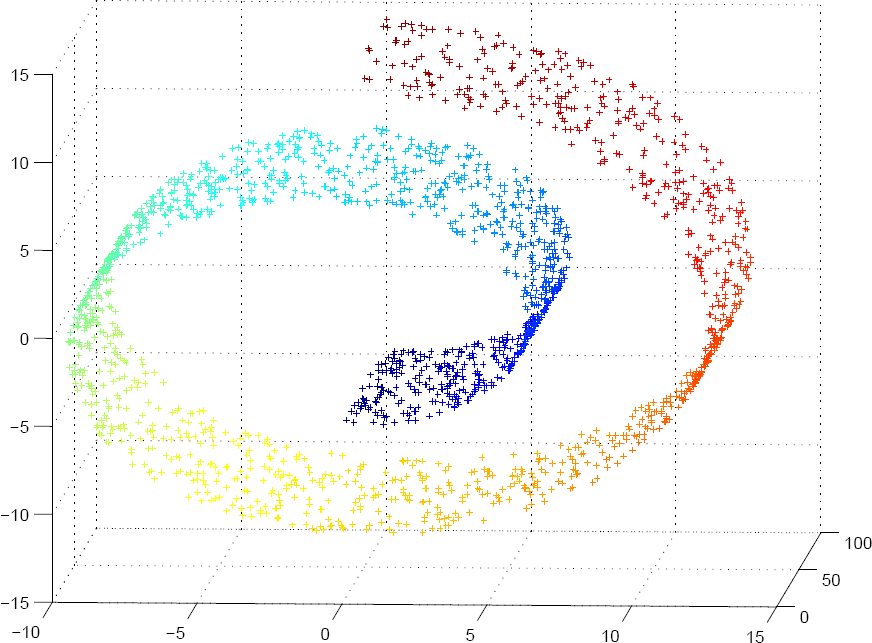

#  Other Unsupervised Learning Methods
Week 7 | Lesson 3.4

### LEARNING OBJECTIVES
*After this lesson, you will be able to:*
- Identify additional unsupervised learning methods 
- State when each additional form of unsupervised learning is implemented

### STUDENT PRE-WORK
*Before this lesson, you should already be able to:*
- Perform dimensionality reduction
- Perform k-means, hierarchical clustering, and DBSCAN

### INSTRUCTOR PREP
*Before this lesson, instructors will need to:*
- Read in / Review any dataset(s) & starter/solution code
- Generate a brief slide deck
- Prepare any specific materials
- Provide students with additional resources

### LESSON GUIDE
| TIMING  | TYPE  | TOPIC  |
|:-:|---|---|
| 10 min  | [Opening](#opening)  | Opening |
| 10 min  | [Introduction](#introduction)   | Where have we been? Where are we going?  |
| 45 min  | [Methods](#guided-practice<a name="opening"></a>)  | Explanation of Methods  |
| 5 min  | [Conclusion](#conclusion)  | Conclusion|

---

<a name="opening"></a>
## Opening (5 mins)
- Open with a real world hook about how some of these methods are being used in business applications (IE: Neural Networks have been found to predict stock markets with a greater accuracy than any other method. 
- Go over the unsupervised methods that we've used thus far. 
- Talk to how these subjects relate to methods we've used thus far; IE: How neural networks can optimize input for SVM

<a name="introduction"></a>
## Introduction: Where have we been? Where are we going?  (5 mins)

So far this week, we've learned about different forms of clustering - including hierarchical, k-means, and DBSCAN, as well as PCA. Today, we're going to walk through some other useful unsupervised learning methods in scikit to add to your data science toolbox. 

In the world of machine learning, there are numerous methods for unsupervised learning that we haven't yet covered. Many of these, specifically Neural Networks, are computationally complex devices that are becoming increasingly popular methods for unsupervised learning. In the financial services world, for instance, neural networks are increasing the optimization of the credit, bond and stock markets and helping funds improve their analysis, leading to profit increases in the tens of millions of dollars. Likewise Manifold Learning, which is a for of dimensionality reduction for non-linear datasets, have been able to handle more computational complex situations. 

Today,  we'll give a brief overview of some of these methods and how to implement them in scikit. 

<a name="guided-practice"></a>
## Overview: Other Unsupervised Learning Methods (30 mins)

### Gaussian Mixture Models ###

More or less, a Gaussian Mixture Model assumes that all data points are made from a finite amount of mixed Gaussian distributions - hence the name *mixture model*. These models are like the **kernal density estimates** and use weighted densities, frequently for clustering applications. These models assign values to clusters based on their **posterior probability** - which is a fancy term for the conditional probability assigned to data or an event after all evidence has been taken into account for a situation. 

The sklearn implementation allows us to learn, sample, and predict these models:

```

from sklearn import mixture

def fit_samples(data):
	gaussmix = mixture.GMM(n_components=2, covariance_type='full')
	gaussmix.fit(data)
	print gaussmix.means_
	colors = ['r' if i==0 else 'g' for i in gaussmix.predict(data)]
	ax = plt.gca()
	ax.scatter(samples[:,0], samples[:,1], c=colors, alpha=0.8)
	plt.show()
	
```
*Note*: The above code is adapted from [this blog post](http://www.nehalemlabs.net/prototype/blog/2014/04/03/quick-introduction-to-gaussian-mixture-models-with-python/)


### Manifold Learning ###

This week we learned about dimensionality reduction in a general sense; however, what happens when we want to perform dimensionality reduction on a *non-linear* dataset? That's where **Manifold Learning** comes in. 

Manifold learning is a way to *generalize* a dinensionality reduction technique like PCA to take into account non-linear structures (such as the graph below) in the data. When we set up Manifold Learning, it learns the structure of a highly dimensional data from the data itself, and then performs the reduction. 




There are a few ways in which we can implement manifold learning; today, we'll look at the scikit implementation of two of them: 


#### Isomapping 

Isomapping is one of the oldest and simplest implementations of manifold learning - it seeks to reduce the dimensionality while mainting the distance between points. 

For an example of this, check out [scikit's documentation](http://scikit-learn.org/stable/auto_examples/manifold/plot_lle_digits.html) for implementating isomap on handwritten digits. 

#### Multidimensional Scaling 

In a basic sense, multidimensional scaling is a method to provide a visual representation of similarities among a group of data. With multidimensional scaling, we're taking a highly dimensional data set and representing it in as little as two dimensions. Essentially, we are conducting a hybrid scaling/dimensionaling reduction technique on our data, which will give us a two dimensional set that looks something like the plot below: 


Scikit gives a great [overview](http://scikit-learn.org/stable/auto_examples/manifold/plot_compare_methods.html#example-manifold-plot-compare-methods-py) of these Manifold Learning methods.

### Artificial Neural Networks ###

Artificial Neural Networks are simulated models of neural networks in the brain. 

In a practical sense, neural networks have become most useful to tackle problems that are simple for the human brain but difficult for machines, IE: pattern recognition. In this manner, we can apply neural networks over a large dataset instead of having a human manually attempt to comprehened the patterns in our data - patterns that may be so abstract the average human oberserver might completely miss! 

When a neural network receives information, it processes it through a system of nodes (see graph below). While this may seem simplistic, a great, intertwined network of these nodes are utilizing parallel computations can be exceptionally powerful. Neural networks *learn* and *adapt* just the way a human brain would to changing information. 


We can implement artificial neural networks as a *supervised learning method* or an *unsupervised learning method*. In the former, we train the network to learn. Let's take the example of a segment of farm animals - a cow, horse, pig, and goat. We can tell train the network to recognize each animal and then have it provide us it's best guesses, and in return we give it the correct answers, and the network then compares its answers to the correct answers and *learns* the correction classifications. The algorithm that actually decides which category something fits into is called the *perceptron*.

With unsupervised neural networks, we train the neural network in a situation where there is not a set of known answers. In scikit, we can implement a form of unsupervivsed neural networks by utilizing **Restricted Boltzmann Machines**, which are models that learn a probability distribution. For more on unsupervised neural networks, check out scikit's [neural networks documentation](http://scikit-learn.org/stable/modules/neural_networks.html)

Now, we'll run through an [example](./assets/code/annex.ipynb) of an artificial neural network in Python. As these processes

<a name="conclusion"></a>
## Conclusion (5 mins)

- Manifold learning is a method for decomposing non-linear datasets
- Artificial neural networks are useful and power tools for processing and learning data
- Gaussian Mixture Models are probabilistic models for smaller groups of data within a larger dataset, without having to identity those features beforehand


### ADDITIONAL RESOURCES

- A great example of [single layer ANN's](http://sebastianraschka.com/Articles/2015_singlelayer_neurons.html) in Python
- The [Manifold Learning documentation](http://scikit-learn.org/stable/modules/manifold.html) in Python. 

