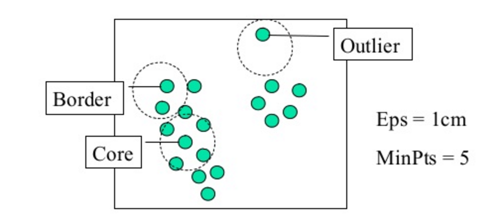

#  DBSCAN 
Week 7 | Lesson 4.2

### LEARNING OBJECTIVES
*After this lesson, you will be able to:*
- Perform a DBSCAN
- Compare DBSCAN to other forms of clustering
- Understand how to interpret the results of their analysis

### STUDENT PRE-WORK
*Before this lesson, you should already be able to:*
- Perform k-means clustering 
- Perform hierarchical clustering
- Understand k-nearest neighbor

### INSTRUCTOR PREP
*Before this lesson, instructors will need to:*
- Read in / Review any dataset(s) & starter/solution code
- Generate a brief slide deck
- Prepare any specific materials
- Provide students with additional resources

### LESSON GUIDE
| TIMING  | TYPE  | TOPIC  |
|:-:|---|---|
| 5 min  | [Opening](#opening)  | Opening  |
| 10 min  | [Introduction](#introduction)   | What is DBSCAN?  |
| 15 min  | [Demo](#demo)  | Implementation of DBSCAN |
| 25 min  | [Guided Practice](#guided-practice<a name="opening"></a>)  | Example of DBSCAN in PYTHON  |
| 25 min  | [Independent Practice](#ind-practice)  | Perform your own DBSCAN |
| 5 min  | [Conclusion](#conclusion)  | Conclusion  |

--- 

<a name="opening"></a>
## Opening (5 mins)
- Ask students to recall the basics of k-nearest neighbor
- Relate the concept of k-nearest neighbor to the idea of a neighborhood, the points in the immediate vicinity of a core point
- Discuss real world relevance of these topics
- Relate topics to the [Data Science Workflow](https://drive.google.com/file/d/0Bx2SHQGVqWasOGY4dE95OFVvZjQ/view?usp=sharing) - i.e. are these concepts typically used to acquire, parse, clean, mine, refine, model, present, or deploy?

**Check:** Ask students to define, explain, or recall any relevant prework concepts.

<a name="introduction"></a>
## Introduction: DBSCAN - What is it? (10 mins)

So far you've learned about two types of clustering algorithms - k-means clustering and hierarchical clustering. Now, we're going to learn about one last clustering algorithm - **density-based spatial clustering of applications with noise**, or as we'll call it from now on, **DBSCAN**.

DBSCAN is the most widely used and applicable clustering algorithm - given that it takes minimum predefined input and can discover clusters of any shape, not just the sphere-like clusters that k-means often computes. This way, we can discover less pre-defined patterns and glean some more useful insights. 

#### How does DBSCAN Work?

DBSCAN is a **density based clustering algorithm**, meaning that the algorithm finds clusters by seeking areas of the dataset that have a higher density of points than the rest of the dataset. Given this, unlike in our previous examples, after you apply DBSCAN there may be datapoints that aren't assigned to any cluster at all! When we use DBSCAN, it requires two input parameters: **epsilon**, which is the maximum distance between two points for them to be considered a cluster (you can also think of this as the max cluster radius), and **minimum points**, the minimum number of points necessary to form a cluster (this prevents outliers or small outlier groups from becoming their own cluster). We can see both of these in action in the diagram below: 



When we run the algorithm - DBSCAN will take the epsilon and minimum points we provided it and cluster all of the points in a *neighborhood*, first passing the minimum points requirement and then clustering each of the points within epsilon distance to form the clusters. Once one cluster is formed, the algorithm then moves to a new datapoint, and seeks to find related points to form yet another cluster; this will continue until DBSCAN simply runs out of points!

This [youtube video](https://www.youtube.com/watch?v=rjMzY0rJPfc) does a good job of showing how the algorithm passes through points and develops the cluster. 

#### How does DBSCAN differ from K-Means and Hierarchical Clustering? 

Whereas k-means can be thought of as a "general" clustering approach, DBSCAN performs especially well with unevenly distributed, non-linear clusters. 

The fundamental difference with DBSCAN lies in the fact that it is *density based* rather than k-means, which calculates clusters based on distance from a central point, or hierarchical clustering. When choosing epsilon in the minimum points in DBSCAN, a selection of < 2 will result in a linkage cluster - essentially the same result as if you were to perform a hierarchical clustering. To diversify the DBSCAN, we therefore must give it a significant amount of points to form a cluster.

- DBSCAN is *density based*, which means that it determines clusters based on the number of points in a certain area
- By choosing too few points for DBSCAN, i.e. less than two, we'll effectively get a straight line if we connect the points, just like linkage clustering.

DBSCAN can be useful to us when we have a lot of dense data. If we used k-means on this data, the algorithm would effectively give us just one large cluster! However with DBSCAN, we can actually break down this cluster into smaller groups to see their attributes. 

**Check:** What does DBSCAN stand for? What does epsilon signify? What does it do differently than k-means and hierarchical clustering?

<a name="demo"></a>
## Demo: DBSCAN in Python (10 mins)

To implement DBSCAN in Python, we first import it from sklearn: 

```
from sklearn.cluster import DBSCAN
```

Next, assuming that we are using the classic Iris dataset, we define X as the data and y are the class variables

```python
X, y = iris.data, iris.target
````

Next, we call DBSCAN from sklearn:

```python
db = DBSCAN(eps=0.3, min_samples=10).fit(X)
```

Here, we've set *epsilon* to a standard value of .3 and set the *minimum number of points* at 10, and then fit the model to our data *X*.

As a general rule when choosing the minimum points - you should always aim to have the minimum number of points be *greater or equal to* the amount of dimensions in your data, plus one. This typically will give the algorithm a good estimation of how to evaluate the clusters. Calculating epsilon is a bit trickier and uses a method called the **k-distance**, which can help visualize the best epsilon. Today, we're going to estimate epsilon so that you can get an understanding of how varying values affect the results of the analysis. 


```python
core_samples = db.core_sample_indices_
labels = db.labels_
```

The DBSCAN algorithm in Python returns two items - the **core samples** and the **labels**. The core samples are the points which the algorithm initially finds and searches around the neighborhood to form the cluster, and the labels are simply the cluster labels.

From here, we can plot the resulting clusters - which we'll go through in the guided practice below!

**Check:** Do you understand how each of the elements of the clustering process work together and how the assumptions are different from hierarchical clustering or k-means clustering. How do epsilon and the minimum points work together? How are the assumptions different from k-means clustering and how does this affect the results? Can you explain this process to a neighbor? 

<a name="guided-practice"></a>
## Guided Practice: DBSCAN on Iris (15 mins)

Now, we're going to work through an implementation of DBSCAN on the Iris dataset for clarity. 

To start, open the [starter code](./code/starter-code/starter-code-guided.ipynb) and follow along with the instructor. 

> [Guided solution code is here](./code/solution-code/solution-code-guided.ipynb)

**Check:** Looking at the results of DBSCAN and the resulting plot, can you see how varying inputs affect the results of the analysis?

<a name="ind-practice"></a>
## Independent Practice: DBSCAN on Airport Operations Data (20 minutes)

Now that you've practiced one implementation of DBSCAN, we're going to be circling back to the FAA airport data from the previous lessons and perform a DBSCAN on it.

We want to look at the airport operations data, as a whole, and use DBSCAN to determine the clusters. Afterwards, we'll want to compare the results of the DBSCAN to those of a k-means to see the differentials in cluster assignments. As part of you're task, you'll have the experiment with various inputs of epsilon and minimum points for DBSCAN, as well as the value of "k" for k-means since this is a raw, dense dataset!

Although it may not always be apparent what the correct answer is - try your best with the knowledge that you have and the information given to you. If you get stuck, compare your solution with that of a classmate.

Where there any areas where you got stuck? What factors may have halted your analysis? 

To start, open the [starter code](./code/starter-code/starter-code.ipynb) and download the [data](./assets/datasets/airport_operations.csv).


**Check:** Were you able to complete the DBSCAN and optimize the algorithm based on the values of epsilon and minimum points?

> [Solution code is here](./code/solution-code/solution-code.ipynb)

<a name="conclusion"></a>
## Conclusion (5 mins)
- DBSCAN is a popular and useful form of cluster analysis
- In DBSCAN, the algorithm needs two parameters - epsilon and the minimum points
- We can evaluate DBSCAN in a similar manner to other cluster analysis methods, and should graphically represents the predicted clusters 

***

### ADDITIONAL RESOURCES

- [Scitkit-learn's documentation for DBCAN](http://scikit-learn.org/stable/modules/generated/sklearn.cluster.DBSCAN.html)
- A [demo](http://scikit-learn.org/stable/auto_examples/cluster/plot_dbscan.html) of DBSCAN in scikit-learn. 
