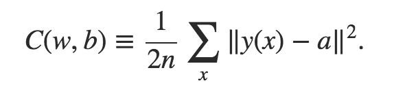

# Field Guide to Neural Networks
#### By Patrick D. Smith.

## Introduction 

Neural Networks *learn* by *training* on observational datasets. 

## Elements of Neural Networks

### Artificial Neurons

#### Perceptrons 

Perceptrons are the most basic artificial neurons that make Neural Networks work. 

Developed in the 1950s by Frank Rosenblatt

A perceptron takes several inputs and determines one singular output. 

To compute output, perceptrons use *weights*, which are simply numbers that represent how import each input signal is to the aggregated final output. The pre-output of the perception is then determined by the summation of these various weighted inputs. Once we have a weight, it is measured against a *threshold value* which will determine the final binary output, say *0* or *1*. 

Say we have two possible binary outputs, 1 and 2, and we need to classify our inputs as such. The perceptron will take *X* inputs and weight, and the 

#### Sigmoid Neurons 

By utilizing Sigmoid Neurons, our 


### Gradient Descent

Gradient descent is an optimization algorithm that is perhaps the most commonly used optimization algorithm in ANN's. 

#### 3. 1 The Cost Function 

The **cost function** or **loss function** allows us to quantify how well our network is approximating it's output. If we call our network weights *W*, this function is directly measuring the quality of weights *W*. We ultimately want to discover the *W* the minimizes the cost function. 




In this function *C* represents the **mean squared error**

**Computing the Gradient**

```python
def eval_numerical_gradient(f, x):
  """ 
  a naive implementation of numerical gradient of f at x 
  - f should be a function that takes a single argument
  - x is the point (numpy array) to evaluate the gradient at
  """ 

  fx = f(x) # evaluate function value at original point
  grad = np.zeros(x.shape)
  h = 0.00001

  # iterate over all indexes in x
  it = np.nditer(x, flags=['multi_index'], op_flags=['readwrite'])
  while not it.finished:

    # evaluate function at x+h
    ix = it.multi_index
    old_value = x[ix]
    x[ix] = old_value + h # increment by h
    fxh = f(x) # evalute f(x + h)
    x[ix] = old_value # restore to previous value (very important!)

    # compute the partial derivative
    grad[ix] = (fxh - fx) / h # the slope
    it.iternext() # step to next dimension

  return grad


```


#### The Backpropogation Algorithm

#### The Cross-Entropy Cost Function

## The Structure of Artificial Neural Networks


## Tuning Neural Networks

### Regularization Methods

### How to Choose Parameters for Neural Networks

## Deep Neural Networks

We've learned about Shallow Neural Networks, but what about Deep Neural Networks or *Deep Learning*? 

### Deep Convolutional Networks

### Recurrent Neural Networks

### Long Short-Term Memory Units (LSTM's)

### Deep Belief Networks

Deep belief nets were popular applications of deep learning for the later half of the 200s.

A Deep Belief Network is a form of a *generative model*. In a generative model, feature neurons can be run backwards, which means that they can generate input values for the network. Going back to our handwriting example, a Deep Belief Network can not only recognize handwritten words, it can generate them. In an essence, this type of networks can *read* and *write* just as a human could. 

DBN's can be used for unsupervised learning. 

While DBN's are the greatest in terms of long term scientific potential, they have fallen "out of fashion" at the moment. 

### Generative Models

### Boltzmann Machines

## Applications of Neural Networks

Deep Neural Networks can be trained to do natural langauge processing, machine translation, and the scientific study of music - known as music informatics

Deep Neural Networks have even been used to effectively play video games by utilizing a convolutional neural network with reinforcement learning. 

## Where are Neural Networks Going? 

### Intention Driven User Interfaces

A long term project of DARPA, Intention Driven User Interfaces will learn the structure of inputs to undetstand what is actually meant by a sentence, so that meaning can be derived from an input. 

#### Siri 

#### Wolfram Alpha

#### IBM Watson 

#### Facebook Deep Text

## Practice with Neural Networks
