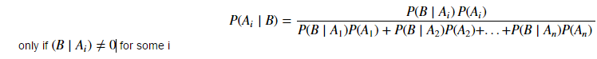
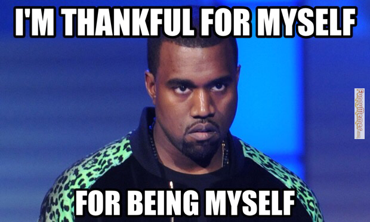
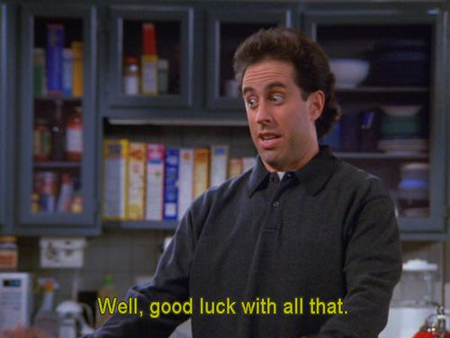

#  Intro to Bayes
Week 8 | 1.1

### LEARNING OBJECTIVES
*After this lesson, you will be able to:*
- Understanding the basics of Bayes Formula/Relation
- Introduction to the "ingredients" of the Bayesian "world view" (i.e. Posterior, Prior, Likelihood
- Do some exercises (conceptual/mathematical) to build greater intuition/facility with Bayesian thinking

### STUDENT PRE-WORK
*Before this lesson, you should already be able to:*
- Understanding of Conditional Probabilities
- Basic facility with Probability of events/sets

### INSTRUCTOR PREP
*Before this lesson, instructors will need to:*
- Read in / Review any dataset(s) & starter/solution code
- Generate a brief slide deck
- Prepare any specific materials
- Provide students with additional resources

### LESSON GUIDE
| TIMING  | TYPE  | TOPIC  |
|:-:|---|---|
| 5 min  | [Opening](#opening)  | Topic description  |
| 10 min  | [Introduction](#introduction)   | Topic description  |
| 15 min  | [Demo](#demo)  | Topic description  |
| 25 min  | [Guided Practice](#guided-practice)  | Topic description  |
| 25 min  | [Independent Practice](#ind-practice)  | Topic description  |
| 5 min  | [Conclusion](#conclusion)  | Topic description  |

---

## Opening (5 mins)

 "*If [one] carries the umbrella and it does not rain, he is mildly inconvenienced. But if he does not carry the umbrella and it rains, he will suffer getting wet. A good Bayesian finds himself carrying an umbrella on many days when it does not rain. The policy actions of the last year were very much in this spirit. The Fed cut the interest rate to 1 percent to prevent the low probability outcome of spiraling deflation because it regarded that outcome as potentially very damaging while the alternative possible outcome of a rise of the inflation rate from 1.5 percent to 2.5 percent was deemed less damaging and more easily reversed.*"
 - Martin Feldstein, former chief economic advisor to Ronald Reagan

What pellucidity can be gleaned from the above depths? Why is the noted Harvard economist talking about rain and umbrellas?

First and foremost let's make something absolutely clear, despite of what Dr. Feldstein has said above, **Bayesianism** is an all-inclusive sex-neutral club (non-Umbrella user concerns notwithstanding).  So rejoice, whether you are a: he/she/some other non-binary optional, you too can (and will) be a Bayesian.

Ready to learn Marty's lingo? All you have to do is memorize and understand a **special formula** (read on below), and all the secrets of world will be revealed to you; and you don't have to even join a carpet cleaning cabal (for the Seinfeld fans out there).

## Introduction: Topic (10 mins)

#### 1.1 Introduction to the Bayes Formula (Part 1 - The Numerator of Bayes Formula):

Behold, the Bayes formula, in it's "almost" full generality for events... Be at ease though, although Bayesian analysis can be viewed as a 'highly mathematical' subject area, the above is the most "ugly" you'll see in these worksheets, roughly pre-calculus level math (or 'maths' for our British readers). In general I will attempt to shield your eyes from the cyclopean edifice, of notational miasma, that is mathematical syntax.
Quite frankly, it's not really needed, and we can accomplish a good deal of the 'operational' knowledge from the formalism via intuition and some finger exercises. Let's get to taking this bad boy apart!
We'll dissect the top of the formula first, the numerator, and start labeling things:

> <INSERT CONDITIONAL PROBABILITY MINI IMAGE>

Statisticians have named this the 'likelihood function'. I don't think Probabilist ever deigned to name it, naming such a trivial form would be beneath the level of the mathematician. That's ok, cause no one pays much attention to the mathematician anyways. The likelihood function is usually a probability model (e.g. Bernoulli, Poisson schemes etc.). The other part of the numerator

> <INSERT PROBABILITY MINI IMAGE>

This is called the 'prior'. Basically the prior is a distribution that represents one's beliefs of something occurring (e.g. of it raining, becoming a millionaire, the sun rising tomorrow etc.), unless your beliefs map onto infinity (then it breaks the bounds of the norm in the Hilbert space, and is pathological blah blah blah). We would call that an "improper prior".
Suffice to say, I don't think any normal person would ever assign the chance of an event occurring in their prior as infinity ... except maybe Kayne.

## Demo: Topic (15 mins)

So to start off, let's go back to Marty's comments on rain and umbrellas. This is an oft used example to explain Bayesian thinking/analysis, and will serve as our first functional exemplar for elementary Bayesian analysis on events. Why events? Events are easily modeled as sets, and thus, are one of the simplest things we can perform on the Bayes analysis. Fear not, we will quickly move to something more useful (namely counting numbers).
Observe the following:

The above stylized view of decision making accurately models a simple Bayesian analysis process. Edges of the tree represent the probability quantity, and directly leads to the nodes/ovals, of what Marty thinks. However, given that Marty's an acolyte of the Chicago school of economics, we can safely assume that he will dutifully follow the suggestions of the output of his prior beliefs on whether it will rain (so this may not be a bad representation after all).

In the context of the language we've established thus far, the edges/lines before the first layer of ovals together represent the "prior", and the four edges after the first layer of ovals, collectively would construct the 'likelihood' mapping (this isn't technically a likelihood function/mapping for reasons which will be clear later in this worksheet, but we'll use that word as a pedagogical tool to help embed that functional form in your head). Finally leading to the terminal set of ovals. Each oval can be thought of as a representation of the whole numerator on the Bayes formula.

### Very Brief Summary of Basic Probability Results:

Probability, like other subfields of mathematics is dense, and you've probably forgotten some of the basic rules, here's a list of a couple useful identities to memorize when thinking about events, likelihoods, and all the other fun stuff you're going to get into throughout this week and your future life as a data scientist:

|     Rule  | Notation  | Written Description
|:-:|---|---|
| Addition Rule  | Assume A, B are independent: $P(A \cup B)=P(A)+P(B)$ |  The probability of A or B is the probability of A plus the probability of B  |
| Multiplication Rule   | Assume A, B are independent: $P(A \cap B)=P(A)P(B) $  |  The Probability of A  and B is just the probability of A multiplied by the probability of B |
| Conditional Probability | Assume A, B are independent: $ P(A &#124 B)=P(A) | The conditional probability of A conditioned on B is just the probability of A if A and B are independent |
| Complimentary   | $ P(A^c) = 1-P(A) $ | The probability of the complement of A is just 1 minus the probability of A |

Time for some light finger exercises!

#### 1.1.1 Finger Exercise 1 - Review of computing the conditionals

Suppose we assume the prior probability distribution can be thought of like a simple bias coined toss, where the probability of it raining is .4. Similarly, assume that the 'likelihood' probability of it raining again can be thought of as a simple biased coin toss, where the probability of it not raining is .9 if Marty thinks it will rain, and the probability of it actually raining is .7 if Marty doesn't think it will rain.

- What is the probability of it actually raining if Marty thought it would rain?
- What is the probability of it not raining if Marty didn't think it would rain?

#### 1.1.2 Finger Exercise 2 - Computing numerically with the basic Bayes formula

Following the scenario above, what is the Probability of it actually raining, given the *total probability* of the prior? (**hint**: We are asking for P(A|B)

## Guided Practice: 1.2 Introduction to the Bayes Formula (Part 2 - The denominator of Bayes Formula)  (25 mins)

As you saw from exercise 1.1.2, taking the "total probability" of the prior involved taking account of both possibilities for the prior, "doesen't think it will rain", and "thinks it will rain", by taking the probability of it raining and dividing it up by the sum of every probability computed in the terminal ovals on the diagram.

Said slightly more formally, the total probability is equivalent to the denominator of the Bayes formula: $ \sum_{i=0}^n P(B|A_i) = P(B|A_1)P(A_1)  + ... +  P(B|A_n)P(A_n)$

Although this formula can seem daunting at first, we can easily explain it in another way to hammer home the intuition

In the above picture, we see that each $A_1,..., A_5$ includes a piece of the center oval, which represents B. Although, in general there could be some intersection between the A's, we've assumed that they, like the rain/umbrella example above, are mutually exclusive events (Although I may relax this assumption in the lab, future finger exercises, or the next few lessons to be cruel).

Also, recall from basic probability, the following relation: $$P(A|B) = \frac{ A \cap B }{B}$$
Intuitively what above relation indicates is that P(A|B) is a ratio of the part of A that is common with B, over the entirety of B. Therefore, the total probability can be thought of as the exhaustive sum of all probabilities on sets that share elements with B, and hence should just equal the probability of B in our set of events!

Whew! So what is the purpose of the total probability with respect to the rest of Bayes formula? I hope it's a little clearer now, that In basic language, it 'normalizes' the numerator into a quantity between 0 and 1.

## Independent Practice: 1.3 The Likelihood Function, The Prior, and the Posterior Distribution (25 minutes)

We're almost done with explaining the basic machinery of Bayesian analysis. You have the intuition, and understand how it can be applied to sets of events or elements. What's left? We'll take Bayes formula from elements to the world of statistics proper

As we know, statistics deals with observations, distributions, samples, parameters etc., and these concepts easily fit inside the Bayesian box. Let's now reel this fish in, and bring it home!

This form should look very familiar to you by now, as it's basically the Bayes formula on sets, with some change in symbols. Where $x_1,..., x_n$ are observations and $\theta$ is the population parameter(s). In particular, we can easily identify $l(x|\theta_i) = f(x|\theta_i)$ as the likelihood function. But there's something funny about this quantity. We'll come back to it later.

For the sake of the rest of this introductory section and lab, we're going to assume $l(x| \theta_i) = {n \choose k} p^{x} (1-p)^{n-x} $, the Bernoulli, $\dfrac{1}{n}$, the uniform, or Poisson.

#### 1.3.1 Finger exercise using Bayes for statistics

Suppose we have a bag full of red and blue billiard balls. What is the probability that the quotient of red balls to blue is some parameter r?

#### 1.3.2 Thought Exercise

We would ordinarily read the left hand side of the above formula as the probability of θ given a sequence of xi, which just symbolize the data.

That makes sense, as we know from previous work, we can condition on the data, and the more data we get, in certain cases, we expect a tighter point estimate, or a higher confidence, etc. Yet how would we interpret the likelihood function
If we were to read it directly, the likelihood function would be the probability of the xi's given θi, the parameter. Think about that for a minute. What does that really mean?

### 1.4 "Bayesians, Frequentist, lend me your ears" - *Keynote speaker at the American Statistical Association*

By now, you should have a sneaking feeling on the difference between Bayesian and Frequentist statistics. The differences can be summarized pretty easily as follows:

1. **Frequentis**t: Believes that the "true" distribution is fixed (and not known), and we can glean more more about the "true" distribution by engaging in sampling, testing for effects, and studying relevant parameters of the population.
2. **Bayesian**: Believes that data/information can inform more "insight" into the population, and as we receive more data/information, our view of the population can be confirmed, or denied, but our view of the population is variable.

The Bayes view (which was actually developed by Laplace), is not only more practical/sensible, but it's impact on modern science has been profound. Everything from simulations, computational biology, and machine learning, primarily utilizes the Bayes approach. It's essentially a heuristic, and it fits neatly into an algorithmic approach or environment.

## Concluding thoughts, or as Jerry Seinfeld once said: "Good luck with all that..." (5 mins)

Some parting thoughts: We won't spend the next eternity discussing the nuances of the likelihood principle, and its ramifications in statistics (probably hundreds of monographs have been written just on that topic, and related issues). In fact, this issue of "inverting" the conditional probability helped start a schism in the field of statistics that lasted over half a century, between the "Frequentist" and the "Bayesian" statistician.

But the likelihood function merits this much explanation at least: It indicates that we can not only have an unknown parameter, like the case of classical frequentist statistics, where our job is usually to 'find' or estimate the unknown population parameter through sampling, but that the parameter can actually be 'random' (in fact, a random variable), and it's definition/properties can be revealed through data, or samples.

Our next steps will be to take these concepts and formalism, develop them further, and also apply them to computing, which is where the real power lies in the Bayesian approach.

### ADDITIONAL RESOURCES

- [Resource 1](http://ocw.mit.edu/courses/electrical-engineering-and-computer-science/6-041-probabilistic-systems-analysis-and-applied-probability-fall-2010/video-lectures/lecture-21-bayesian-statistical-inference-i/)
- [Resource 2](http://people.stern.nyu.edu/wgreene/MathStat/Notes-2-BayesianStatistics.pdf)
