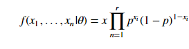

#  Bayes Deep Dive
Week 8 | 1.3

### LEARNING OBJECTIVES
*After this lesson, you will be able to:*
- Understand the MLE in the context of basic Bayesian analysis
- Conceptually explain the construction of some MLE of parameters for several distributions
- Review of the construction of the MLE with some basic Calculus

### STUDENT PRE-WORK
*Before this lesson, students will need to be able to:*

- Basic Probability Theory
- Concepts of optimization
- Derivatives from calculus
- Facility with NumPy

### INSTRUCTOR PREP
*Before this lesson, instructors will need to:*
- Read in / Review any dataset(s) & starter/solution code
- Generate a brief slide deck
- Prepare any specific materials
- Provide students with additional resources

### LESSON GUIDE
| TIMING  | TYPE  | TOPIC  |
|:-:|---|---|
| 5 min  | [Opening](#opening)  | Maximum Likelihood Estimators, Towards Deeper Bayesian Analysis |
| 10 min  | [Introduction](#introduction)   | Introduction: 1.1 Finding the global maxima  |
| 15 min  | [Demo](#demo)  | The problem with generalizing - Demo: Topics and Finger Exercises |
| 35 min  | [Guided Practice](#guided-practice<a name="opening"></a>)  | Guided Practice:  Finger Exercise 1.1.1 - Thinking about the product rule |
| 25 min  | [Independent Practice](#ind-practice)  | Independent Practice: Problems with the MLE Method |
| 5 min  | [Review/Recap](#conclusion)  | Topic description  |

---

<a name="opening"></a>
## Opening - 1.1 Finding the global maxima (5 mins)

> **ATTENTION IMPORTANT INSTRUCTOR NOTES:** I have noted that the students entering in the first class may actually really struggle with some of this mathematics for whatever reason. I have attempted to really try to reduce the material's complexity as much as possible. However, the topic is what it is, you can't really get around mathematics when dealing with Bayes. Therefore, I suggest that you utilize this very handy tool: https://www.wolframalpha.com/.

> This is basically an online instance of Mathematica, but on crazy steroids. You can actually use natural language to type "take the derivative of ___formula____" and Wolfram Alpha will try to understand what you're saying and actually execute (and show steps). This may prove to be a godsend for any students who are struggling/forgotten these critical skills, and will help them get back up to speed, if they are diligent and play around with it.

Before we introduce the topic of *maxima* and *minima*, we'll mention some resources to review basic derivatives.

- [Khan Academy lectures/notes on basic differentiation](https://www.khanacademy.org/math/differential-calculus/taking-derivatives)
- In particular, [check out the video for taking derivatives of the form f(x) = x^2](https://www.khanacademy.org/math/differential-calculus/taking-derivatives/derivative-intro/v/calculus-derivatives-2-5-new-hd-version).

This will be the extent of Calculus you'll need to know to understand MLEs under the hood! But we also highly recommend that you check out [this simple page from Brown University's math department](http://www.math.brown.edu/UTRA/derivrules.html). This will go over the basic rules of **univariate differentiation**.

**Check**: Take a few minutes to review the materials, discuss in groups, and prepare any questions. Afterward, we'll move onto the calculations!

> Note: When you feel your students have a relative understanding of these issues, move forward.


<a name="introduction"></a>
## Introduction: 1.2 Analytically finding the peak  (10 mins)

Calculating the *global maxima* (or minima) is a fairly simple procedure; however, it will require a little bit of the calculus that we referenced above.

Suppose we took a simple Bernoulli function: `$p^5(1-p)^$4$`. Let's say we wanted to find the *maximum value* of this function, what would that mean?

1. The function would have to "peak" at some point; therefore, in some way, the function would have to look somewhat like a inverted parabola (high school algebra people, remember it!).
2. This peak would have to be a 'global' peak, i.e. it can have multiple peaks, but only one can be the 'largest'
3. Once we find the peak, the value/level of the peak is not what we're actually interested in (the Y-value of the function). What we're actually interested in is to guess which X-value of the function (the independent variable), needs to be inputted to get a particular Y.

For kicks, we'll also add the condition that the function has to be continuous and differentiable, henceforth referred to as **nice** functions.

> Note: Although this last requirement is not explicitly needed for finding/calculating global maxima, the techniques developed for MLE will be much easier to demonstrate if our functions have this property.

```python
from matplotlib import pyplot as plt
import numpy as np

x = np.linspace(0,1,100)   # We want to ensure we have enough "granularity" in the graph so we set hasmarks to 100
y = x**5*(1-x)**4  # Mapping the Bernoulli scheme
plt.plot(x,y)

#Uncomment this after reading / working through 1.2
#plt.axvline(x=.55556,color='k',ls='dashed')

plt.show()
```

Perfecto! We have a nice plot that satisfies the above requirements. We can eyeball the peak of this upside down parabola, but that's not really 'scientific', and we are after all, aspiring data scientists, so we seek precision!

In the context of the plot we just made, how can we characterize the peak? The easiest way is to note that it's a point of 'inflection' on the graph that is before the peak, the slope of the graph is positive and so after the peak, the slope of the graph is negative. This is great, because whenever we start talking about slopes for **nice** functions we can bring in our friend, *Calculus*.

In particular, if the slope of the graph is positive at one side of the graph, and negative on the other, it must at some point be 0. This is a condition (but not always sufficient) we need to have to find the peak.

**Check**: Restate the definition of inflection points given here.

`$\frac{d}{dp} p^5(1-p)^4 = 0$.`

This is a product, and hence, we utilize the product rule to analytically solve the derivative to get the following:

`$$5p^4(1-p)^4 - 4(1-p)^3p^5 = 0$$`

We now "balance" the equation by taking the conveniently negative part of the left-hand side to the right-hand side and get the following:

`$$ 5p^4(1-p)^4 = 4(1-p)^3p^5 $$`

Do some algebra, and we get the following:

`$p = .55556$`

Did it work? Uncomment out the plt.axvline in the code above and see!

> Note: This is referring to the commented line: `plt.axvline(x=.55556,color='k',ls='dashed')`

## Demo: The Problem with Generalizing - Topics and Finger Exercises (5 mins)

So you've learned a new trick. Great!

Now you can go forth and solve all global maxima problems right?

Well... we did it for a Bernoulli scheme, but in general, if we wanted to compute the likelihood function as part of a posterior, we would need take the joint Bernoulli distribution, which (assuming independent identically distributed), would look something like this:



That's a (sort of) bummer, because if we wanted to get the derivative of `p`, we would have to compute `r` terms applying the product rule for each `i-th` product sequentially.

Actually, this isn't really that hard, but because we're humans, and not computers, our squishy brains don't like to deal with a long string of slightly different symbols, we much rather deal with long strings of more or less similar symbols. So someone a long time ago (probably a Frenchmen), came up with a work-around.

## Guided Practice: Finger Exercise 1.1.1 - Thinking about the product rule (35 mins)

Instructions: Show (formally or informally) that the product rule for derivatives applied to `r` terms will yield a summand of r-terms. This can be shown formally by mathematical induction, but if you don't have that background, just reason by taking the definition and applying it first to 3 terms, then 4, then 5, and so on.

**Check**: Perform the finger exercise 1.1.1 and discuss results in pairs.

Was that really so hard? Do we need a work-around?

### Enter the Log-Likelihood Procedure

So what's the trick we often use in machine learning/statistics, when we have a product of something and want to decompose it into a summand? Think back to your regression module...

You got it! Use the log!

> Note: These next series of finger exercises may prove difficult depending on the quantitative skill of the class. You may want to just go over a few with them over the board and then have them do one together in groups.

| Name  | Formula  | Description  |
|:-:|---|---|
| Poisson Distribution | $\frac{e^{-n}n^{x}}{x!}$   | The probability of observing x events in a certain time interval. e is the Euler number and n is a tuning parameter  |


### Finger Exercise 1.1.2 - Compute the Log-likelihood of the joint Bernoulli distribution

Instructions: Similar to Finger Exercise 1.1.1, we're going to ask you to find the MLE of a population parameter for some well-used distributions.

Take the log of the Bernoulli joint distribution and see how far you can go in simplifying it.

**Check:** As stated above, taking the derivative of the r-joint distribution directly would yield `r` terms, can you simplify your log-likelihood further? Wouldn't taking the log of the Bernoulli scheme actually double the number of terms?  

> Instructor's Note: Recall again that all you're doing is taking the log of the Bernoulli distribution so you should end up with something like `$$ln(x^n(1-x)^{N-n})=n(ln(x))+(N-n)ln(1-x)$$`. The student should know how to use logarithms and interpret them - not only for the material here, but the fact that log-transformations are commonly and regularly used in data science/machine learning/statistics/modeling in general.

> If the student is unfamiliar, [go through some earlier lessons and have them watch some videos](https://www.khanacademy.org/math/algebra2/exponential-and-logarithmic-functions/properties-of-logarithms/v/introduction-to-logarithm-properties)

### Finger Exercise 1.1.3 - Computing the MLE for parameters

Find the MLE of the mean parameter for a Poisson distribution

> Instructor's Solution: Remember, you should probably utilize [Wolfram Alpha](https://www.wolframalpha.com/), to help show steps for some of the more esoteric steps in calculus. This tool can be leveraged to great effect, I've tested it on some people and was amazed how quickly they were able to leverage it's power to learn some tricky mathematical steps. This and the finger exercise below are basically just Left-hand side (LHS)/right-hand side (RHS) "proofs". Just start with the LHS, know which identities to utilize, and massage the form to get the RHS.

**PROOF**: Start by defining our Poisson counts, remember, the Poisson distribution will be a finite sequence, representing observations given within a specified length of time. Therefore if we define the counts as `$C = c_1, c_2,...,c_n`, we have the following - `$$\sum_i^{n} ln(P(C|\mu))=\sum_i^n (e^{-\mu}\frac{\mu^{c_i}}{c_i!})$$`

> Note: This is just taking the log on "both sides" - but you're really just taking the log of a bunch of products, which makes it into *a sum of logs*, and we're just doing it for the formula for Poisson.

Then, we can make that series into the following form: `$$-n\mu+\sum_ic_i ln(\mu)-\sum_i ln(c_i!)$$`

After this, we actually show how the "optimization" looks like by the following: `$$\frac{d}{d\mu}ln(P(c|\mu))=-n + \frac{\sum_i c_i}{\mu} = 0 $$`. Again, emphasizing that we want to take the derivative with respect to `$mu$` of the Poisson form we derived and set it equal to 0. This is basically just the definition of optimization. Finally, if we do that then we get the final results: `$$\mu=\frac{1}{n}\sum_i=1^n c_i$$`. That's it!!

> Basically, you should also talk to the students how this may have been relatively simple to execute for a Poisson distribution, because it has nice properties, and a easy formula/functional form. However, the machine does this all very quickly, and can execute and find the numerical solution even if it's not a very *nice* formula. You may also want to emphasize that when you execute a logistic regression, or do some parameter estimates, this type of procedure is actually happening in the background, **and you just don't see it because the computer does all the work for you!**


## Independent Practice: Problems with the MLE Method (25 minutes)

### Plotting the prior, likelihood and posterior

So you may start to wonder, I get that MLE applies to the likelihood function, but hey! Isn’t Bayesian analysis more than just the likelihood function? Aren't we supposed to be taking into account prior data, if we were good Bayesians?

The answer to both questions are: yes!

For several reasons, MLE is not always the best procedure for Bayesian inference.

One obvious issue is overfitting numerically to just the functional form of the likelihood, and not taking into account any prior data. Of course, to take into account the prior, you will have to do a similar optimization scheme on the whole posterior, as opposed to individual components of the posterior (i.e. likelihood).

This second optimization is called appropriately enough: Maximum A-Posterior Estimation (MAP)

Need a review? Check out [the following resource](https://www.probabilitycourse.com/chapter9/9_1_2_MAP_estimation.php) and [video](https://www.youtube.com/watch?v=kkhdIriddSI) for MAP.

> Note: My suggestion is that you want to emphasize that there's less overfitting with MAP, as opposed to MLE. If you think this point will be a bit too esoteric with the audience, you may just want to leave it simply as: "MAP is often found to be a more accurate procedure when estimating the Posterior distribution." And leave it at that :)


### Challenge Problem - Conceptual Exercise 1.2.1 (Approx. 10 - 15 mins)

> Instructor's Note : This is primarily a "thinking" exercise and will take up the preponderant amount of the 25 mins. Have them talk it through in small groups; some may want to prove it formally, but that's not needed. Time should take approx 15 - 20 mins, depending on your students' quantitative strengths.

This a 'thinking-cap' and pen/paper exercise. In general, when would an MLE and MAP yield the same solution? Demonstrate this fact analytically by taking the derivative of the posterior with respect to the parameter.

**Check**: What interesting factor disappears?

### Challenge Problem - Conceptual Exercise 1.2.2 (Approx. 5 - 10 mins)

Now let's demonstrate when MLE = MAP visually!

Instructions: Do this individually. Use Numpy to visualize the Bernoulli scheme on an X-Y grid. Show how a prior distribution can affect the posterior (or the product of the two).

```python

# Solution

from matplotlib import pyplot as plt
import numpy as np

x = np.arange(0,1.,.01)   # We want to ensure we have enough "granularity" in the graph so we set hash marks to 100
y = (x**5)*(1-x)**4  # Mapping the Bernoulli scheme

# Alter the prior and see how that visually alters the posterior

prior = (x**.46)*(1-x)**.32
z = y*prior

#plt.plot(x,prior)
plt.plot(x, y, 'r',x, z, 'g--')
plt.axvline(x=.55556,color='k',ls='dashed')

plt.show()

```

## Review/Recap (5 mins)


***

### ADDITIONAL RESOURCES

- For those who want a challenge, and are curious/fascinated by this topic, [this is an EXCELLENT reading on the history (historical/analytic development) of the MLE](https://arxiv.org/pdf/0804.2996.pdf)

- A fairly ["calculus-light" slide deck summarizing MLE](http://spia.uga.edu/faculty_pages/monogan/teaching/ts/B2mle.pdf)

- This will provide alternative proofs / commentary on MLE for various distributions. It's probably also good for your background if you are [up for a really deep-dive challenge](https://onlinecourses.science.psu.edu/stat504/node/28)
