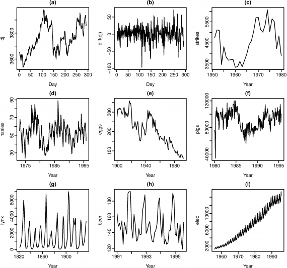

#  Time Series Analysis Recap
Week 9 | Lesson 5.1

### STUDENT PRE-WORK
- Complete all relevant lessons and labs from earlier in the week

### INSTRUCTOR PREP
*Before this lesson, instructors will need to:*
- Review all previous lessons and labs from the week and identify areas of confusion or opportunities for further knowledge sharing
- Prepare extra graphs (ACF, PACF, Time Series, etc.) to quiz your students and discuss further details about Time Series Analysis
- Add talking points to the Topic Recap section based on this information
- Provide students with additional resources to continue their self-learning in these subjects

### LESSON GUIDE
| TIMING  | TYPE  | TOPIC  |
|:-:|---|---|
| 5 min  | [Opening](#opening)  | Intro to Recap  |
| 5 min  | [Exercise](#review)  | Review  |
| 10 min  | [Topic](#github)   | Github For Teams  |
| 10 min  | [Topic](#pandas)   | Pandas and Time Series Analysis  |
| 10 min  | [Topic](#autocor)   | Autocorrelation  |
| 10 min  | [Topic](#stationarity)   | Stationarity  |
| 10 min  | [Topic](#arima)   | ARIMA Model  |
| 20 min  | [Case Study](#casestudy)   | Case Study  |
| 5 min  | [Conclustion](#conclustion)   | Summary  |

---

> Instructor's Note: Before this lesson, go ahead and add talking points to each section as you find needed. You will know best which areas your students stumbled, and what lessons can be learned from the trials and tribulations of this week.

## Opening (5 mins)
This week we have covered quite a bit of ground. From Github Team Workflows, to various different Time Series Analysis techniques, to working on a group project with a real world data set.

This lesson will be a recapitulation of the topics covered this week. We will discuss major takeaways from each lesson, lab, and exercise. This is your chance to fill in any holes in the learnings we've covered and to ask questions which will help guide your own self-learning of these concepts.

The concepts covered this week take most professionals many years to master. At this point you should have a general idea of the fundamentals of each, but don't feel as though you should know everything about them. Being exposed to these skills should help you see more about what the day-to-day for a Data Scientist looks like- Too much data, and not enough time!

We're going to quickly recap the past 5 days by focusing on a few talking points per subject. This is less of a lecture and more of a conversation, so feel free to ask questions that might help guide the discussion. 

## Exercise: Review (5 mins)

Before this lesson, please take 5 minutes to review your notes from the past week and identify areas in which you either did not quite understand the material, or areas in which you would like to further your knowledge.

Be sure to note at least one question or conversation point per topic for the following:

- Github for Teams
- Pandas and Time Series Analysis
- Autocorrelation
- Stationarity
- The ARIMA Model
- The SARIMA Model

## Introduction: Recap Conversation

## Topic: Github For Teams (10 mins)

Let's start with the Github For Teams lesson and lab. We laid out a few different workflows, and simulated them within our groups. Here are a few prompts to start the discussion:

1. Which of the workflows did everyone prefer?

> Is there one that seems most popular, or does everyone have their preference?

2. As you've worked together with partners on labs and the Kaggle data set, have you come across any stumbling blocks that stunted the Project Management process?
3. How was the labor divided amongst your group? Was this a difficult division, or did it work out well?
4. Has anyone had the chance to research other source control utilities? If so, what did you find?

> Take this time to briefly discuss SVN, and any other source control utility you have used. The takeaway should be that there are multiple different approaches, each with their own pros and cons for each team.

## Topic: Pandas and Time Series Analysis (10 mins)

> Instructor Note: This section should be brief, but try to focus on areas in which students struggled with these tools/concepts. Feel free to gloss over if there weren't any issues. It might be a good idea to pull up a python REPL and demonstrate these skills.

We've spent a lot of time loading TS data into Pandas. Recall that Pandas has built in capabilities for handling indexes that hinge on time sensitive data. Let's discuss some of the intricacies.

1. What tools has everyone found useful for working with Time indexes?
2. Do you feel confident in your ability to pivot, stack, and mutate data based on DateTime object indexes? What areas do you struggle with and what can you do to improve these skills?
3. What techniques do you think would be important as our data scales? (i.e. windowing, chunking, etc.)

## Topic: Time Series Analysis - Autocorrelation (10 mins)

1. What is Autocorrelation, and what is it used for?
2. Let's recall the formula for Autocorrelation. Can anyone write it on the board? Let's discuss the terms, and what they mean.
3. What are some of the necessary data transformations you may need to perform to assist in computing Autocorrelation?
4. Let's discuss the various expanding and windowing functions available in Python. Who can name a few, and when should they be used?
4. What is the ACF graph, and how do we read it?

## Topic: Stationarity (10 mins)

To start off, who can define Stationarity for me?

> Answer: A stationary process has the property that the mean, variance and autocorrelation structure do not change over time. In Time Series Analysis, we commonly assume stationarity.

Pop Quiz! Let's take a look at the following graphs. Who can tell me which appear to be stationary, and why?

a - Dow Jones index on 292 consecutive days
b - Daily change in Dow Jones index on 292 consecutive days
c - Annual number of strikes in the US
d - Monthly sales of new one-family houses sold in the US 
e - Price of a dozen eggs in the US (constant dollars)
f - Monthly total of pigs slaughtered in Victoria, Australia
g - Annual total of lynx trapped in the McKenzie River district of north-west Canada 
h - Monthly Australian beer production 
i - Monthly Australian electricity production

> Answer:
> a - No, clear trend
> b - Stationary
> c - No, clear trend
> d - No, clear seasonality
> e - No, clear trend
> f - No, clear trend
> g - Stationary
> h - No, clear seasonality
> i - No, clear trend, and increasing variance over time.

> Instructor's Note: Discuss Stationarity, and the reasons why it is important in TSA. By now students should have a clear grasp of the subject, but now is their chance to fill any gaps in knowledge.

## Topic: ARIMA Model (10 mins)

Let's take a step back and remember what the ARIMA model is, at its basics. By combining Autoregressive, Moving Averages, and integration terms, we are able to compute what is essentially a regression using past points of data as features, in addition to the moving averages. 

> Instructor's Note: This week was _very_ difficult. The models and concepts covered are usually taught over the course of a full semester in many stats programs. It is imperative to explain to the students that they were given an introduction to the ARIMA model as a means to an end- to display some of the more difficult concepts, and the challenges that data scientists face in the field. Ask the students what parts they did not understand, and discuss the concepts that were not
> covered that they would need to research in order to gain a full working knowledge of the model and its usage.

Discussion:

1. What are some real-world uses of the ARIMA model?
2. Why does ARIMA work?
3. What are the parameters of ARIMA, and how do you estimate them?
4. How are ACF/PACF graphs read and interpreted?

Discuss the Seasonal ARIMA model:

1. What problem is it meant to fix?
> Answer: Seasonality in data causing anomalies in predictions using the ARIMA model
2. What new terms does it introduce?
> Answer: Seasonal p, d, q, and an extra term for periods per season, aka _m_.
3. How is it tuned?
 

## Case Study (20 mins)

In the assets folder, you'll find a PDF of an ARIMA case study. In this study, Patra, Chakraborty, and Ghosh used time series analysis to predict notes in Indian Ragas, which are essentially traditional folk melodies. 

Take a few minutes to read the case study. The first half is mostly introduction to AR, MA, and ARIMA concepts, so feel free to skip to section 5. 

We'll spend the rest of the class discussing this case study. 

> Instructor's Note: Discuss the methodology used to estimate parameters, the use of the Ljung-Box test for fit, and have the students interpret the data in section 6 - Results.

> Data taken from Annals. Computer Science Series. 9th Tome 1st Fasc. – 2011

## Conclusion (5 mins)
> Instructor's Note: Now is your chance to summarize the week. Button up everything that has been studied up to this point, and congratulate your students on making it through a particularly difficult course of study!

- Summarize the conversations in this lesson
- Discuss additional resources for further education in TSA
- Check to make sure everyone is on course to complete their Kaggle project

***

### ADDITIONAL RESOURCES

Case Studies:

- [Hydrological Drought Forecasting using ARIMA Models](http://ecopersia.modares.ac.ir/article_14033_5283.html)
- [Manufacturing Case Study](http://ucanalytics.com/blogs/arima-models-manufacturing-case-study-example-part-3/)
- [Analysis and Forecasting of Salinity](http://www-usr.rider.edu/~hsun/apalach.pdf)
